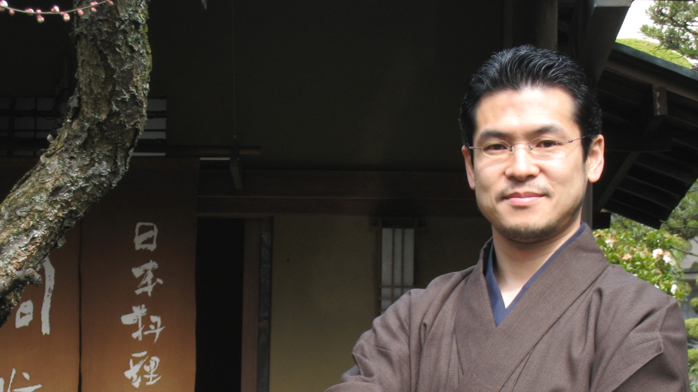

<a href="./japanese">日本語のページ</a>

Professor, [Language Model Interpretability Team](https://www.mint-nlp-mbzuai.com/), NLP Department, [MBZUAI](https://mbzuai.ac.ae/), UAE  

Professor, [Tohoku NLP Group](https://www.nlp.ecei.tohoku.ac.jp/) (Center for Language AI Research), [Tohoku University](http://www.tohoku.ac.jp/english/), Japan

Leader of [Natural Language Understanding Team](http://www.riken.jp/en/research/labs/aip/goalorient_tech/nat_lang_understand/), RIKEN AIP, Japan  

  
email: kentaro.inui (at) mbzuai.ac.ae  
phone: +971 2 811 3282  
twitter: [@inuikentaro](https://twitter.com/inuikentaro)  
Masdar City, Building 1B, 3rd Floor, Abu Dhabi, UAE 

I am a Professor in the NLP Department at MBZUAI in UAE. My research encompasses a broad spectrum of NLP domains, focusing primarily on the computational modeling of semantics and discourse, knowledge-intensive reasoning for language comprehension, and the interpretability and trustworthiness of large language models. I am also deeply interested in the educational applications of NLP, conducting research in areas such as explainable automated writing evaluation and argumentation diagnosis. Before joining MBZUAI, I led the NLP Lab at Tohoku University Japan for over ten years and the Natural Language Understanding Team at RIKEN for seven years in Japan. In addition to my role at MBZUAI, I actively retain affiliations with both institutions, engaging in close collaborations and ongoing research initiatives.

* * *

### Research

- [Research fields](https://www.nlp.ecei.tohoku.ac.jp/research/research-topics/)  
    natural language processing, computational linguistics, artificial intelligence & inference, semantic and discourse analysis, NLP for educational assessment, Web computing, dialogue understanding, and management
- [Recent publications](https://www.nlp.ecei.tohoku.ac.jp/research/publications/) ([publications before 2009](https://www.cl.ecei.tohoku.ac.jp/~inui/publication_list.html))

### Academic & Career History

- 9/2023-present: Professor, Natural Language Processing Department, [MBZUAI](https://mbzuai.ac.ae/), UAE
- 10/2016-present: Leader of [Natural Language Understanding Team](http://www.riken.jp/en/research/labs/aip/goalorient_tech/nat_lang_privacy_understand/), [RIKEN Center for Advanced Intelligence Project (AIP)](http://www.riken.jp/en/research/labs/aip/)
- 3/2010-present: Professor, Graduate School of Information Sciences, Tohoku University
- 10/2011-present: Visiting Professor, [National Institute of Informatics](http://www.nii.ac.jp/en/), Japan
- 10/2006-3/2018: Visiting Researcher, [National Institute of Information and Communication Technology](http://www.nict.go.jp/en/index.html), Japan
- 2/2004-12/2004: Visiting Researcher, University of Sussex, UK
- 10/2001-2/2010: Associate Professor, Graduate School of Information Science, Nara Institute of Science and Technology
- 10/1998-9/2001: Research Fellowship, [PRESTO](http://www.jst.go.jp/kisoken/presto/en/index.html), [Japan Science and Technology Corporation](http://www.jst.go.jp/EN/)
- 4/1998-3/2002: Associate Professor, Department of Artificial Intelligence, Kyushu Institute of Technology
- 4/1995-3/1998: Research Associate, Graduate School of Information Science and Engineering, Tokyo Institute of Technology
- 3/1995: Ph.D. from Graduate School of Information Science and Engineering, Tokyo Institute of Technology
- 4/1992-3/1995: Research Fellowship, [Japan Society for the Promotion of Science (JSPS)](http://www.jsps.go.jp/english/index.html)
- 3/1990: B.E. from Department of Computer Science, Tokyo Institute of Technology

### Academic activities

- Chairperson of [Association for Natural Language Processing](https://www.anlp.jp/) (2022/3-present)
- Area Co-chair of [Association for Natural Language Processing](https://www.anlp.jp/en/index.html) (3/2022-present)
- ACL Rolling Review (ARR) Action Editor (2021/5-present)
- Workshop Co-chair for ACL-IJCNLP 2021
- Vice-chairperson of [Association for Natural Language Processing](https://www.anlp.jp/en/index.html) (3/2020-3/2022)
- Workshop Co-chair for ACL-IJCNLP 2021
- Area Co-chair for [COLING 2020](https://coling2020.org/)
- Area Co-chair for [ACL 2020](https://acl2020.org/)
- General Chair of [EMNLP-IJCNLP 2019](https://www.emnlp-ijcnlp2019.org/)
- Editor in Chief of [Journal of Natural Language Processing](http://www.anlp.jp/en/guide/index.html) (4/2018-2019)
- Member of [Science Council of Japan](http://www.scj.go.jp/en/index.html) (1/2018-present)
- Director of [NPO FactCheck Initiative Japan](http://fij.info/) (6/2017-present)
- Area Chair for EMNLP 2017
- Vice Editor in Chief of [Journal of Natural Language Processing](http://www.anlp.jp/en/guide/index.html) (4/2016-2018)
- Director of [Association for Natural Language Processing](http://www.anlp.jp/en/index.html) (4/2016-3/2020)
- Chief Examiner of [IPSJ SIG of NLP](http://www.nl-ipsj.or.jp/index-e.html) (4/2014-2018)
- Area Chair for COLING 2016
- Area Chair for EMNLP 2015
- Editor in Chief of [Journal of Information Processing](http://www.ipsj.or.jp/english/jip/index.html) (6/2014-5/2015)
- Area Chair for COLING 2014
- Vice Editor in Chief of [Journal of Information Processing](http://www.ipsj.or.jp/english/jip/index.html) (6/2013-5/2014)
- Director of [Information Processing Society of Japan](http://www.ipsj.or.jp/english/index.html) (6/2013-5/2015)
- Director of [Association for Natural Language Processing](http://www.anlp.jp/en/) (4/2012-4/2015)
- Faculty Advisor for ACL 2012 Student Research Workshop
- Tutorial Co-chair of IJCNLP 2011
- Editorial Board Member of [Computational Linguistics](http://www.mitpressjournals.org/loi/coli) (1/2009-12/2011)

- Membership:
    - [Association for Computational Linguistics (ACL)](http://www.aclweb.org/)
    - [Association for the Advancement of Artificial Intelligence (AAAI)](http://www.aaai.org/home.html)
    - [Association for Natural Language Processing](http://www.anlp.jp/en/)
    - [Japanese Society for Artificial Intelligence](http://http://www.ai-gakkai.or.jp/en/)
    - [Information Processing Society of Japan](http://www.ipsj.or.jp/english/index.html)

- [Previous activities](./previous_activities)

### Awards

- Commendation for Science and Technology by the Minister of MEXT (2022)
- [Awards for Science and Technology, the Commendation for Science and Technology by the Minister of Education, Culture, Sports, Science and Technology](https://www.mext.go.jp/b_menu/houdou/mext_00989.html) (2022)
- [NLP-2022 Best Paper Award](http://www.anlp.jp/award/nenji.html)
- [JNLP 2021 Best Paper Award](https://www.anlp.jp/en/award/ronbun.html)
- [NLP-2021 Best Paper Award](http://www.anlp.jp/award/nenji.html)
- [NLP-2020 Language Resource Award](https://www.gsk.or.jp/event/nlp2020-lra/)
- [NLP-2020 Best Paper Award](http://www.anlp.jp/award/nenji.html)
- [Google Focused Research Award](https://ai.google/research/outreach/focused-research-awards/) (2019)
- [NLP-2019 Language Resource Award](https://www.gsk.or.jp/event/nlp2019-lra/)
- [NLP-2019 Best Paper Award](http://www.anlp.jp/award/nenji.html)
- [JSAI 2017 Best Paper Award:](http://www.ai-gakkai.or.jp/about/award/jsai_award-paper/)
- [NLP-2018 Best Paper Award](http://www.anlp.jp/guide/news/v25n2/index.html#third)
- [EACL2017 Outstanding Paper Award](http://www.is.tohoku.ac.jp/jp/news/award_p/detail---id-330.html)
- [NLP-2017 Best Paper Award](http://www.ecei.tohoku.ac.jp/ecei_web/information/2017/news20170322.html)
- [MIRU2016 Outstanding Paper Award](https://sites.google.com/site/miru2016hamamatsu/home/awards)
- IBM Faculty Award (2016)
- [NLP-2016 Best Paper Award (First Place)](http://www.anlp.jp/award/nenji.html#2016)
- [NLP-2016 Best Paper Award](http://www.anlp.jp/award/nenji.html#2016)
- SIG-NL-225 Excellent Research Award (2016)
- [PACLIC-29 Best Paper Award (Computation)](http://bcmi.sjtu.edu.cn/~paclic29/accepted.php)
- [14th Docomo Mobile Science Award](http://www.mcfund.or.jp/docomo_science/winners.html) (2015)
- [SIG-NL-221 Excellent Research Award](http://www.nl-ipsj.or.jp/#award_research) (2015)
- [NLP-2015 Best Paper Award (First Place)](http://www.anlp.jp/award/nenji.html#2015)
- [JNLP 2014 Best Paper Award (First Place)](https://www.anlp.jp/en/award/ronbun.html)
- [AMT2014](http://wic2014.mimuw.edu.pl/amt/homepage) Best Paper Award
- 2014: [ANLP 20th Anniversary Best Paper Award](https://www.anlp.jp/en/award/ronbun.html)
- NLP-2014 Best Paper Award (First Place)
- NLP-2014 Best Paper Award
- [JNLP 2013 Best Paper Award](https://www.anlp.jp/en/award/ronbun.html)
- NLP-2013 Best Paper Award
- NLP-2012 Best Paper Award
- CICLing-2011 Best Paper Award (First Place)
- NLP-2010 Best Presentation Award (First Place)
- NLP-2007 Outstanding Presentation Award
- COLING/ACL-2006 Best Asian NLP Paper Award
- Noguchi Award, DICOMO2006
- NLP-2004 Outstanding Presentation Award
- NLP-2003 Outstanding Presentation Award,
- Outstanding Paper Award, SIG-SLUD, Japanese Society for Artificial Intelligence (2001)
- Annual Best Paper Award of the Japanese Society for Artificial Intelligence (1998)
- NLP-1999 Outstanding Presentation Award
- NLP-1996 Outstanding Presentation Award

### Private

My favorite [izakayas](http://en.wikipedia.org/wiki/Izakaya) in Japan:

- すけぞう　昭和の香り残る壱弐参（いろは）横町の一角、すばらしい常連さん達に出会えます。仙台市青葉区一番町壱弐参横丁（022-227-5177）
- 文ちゃんうどん　私の中では仙台の「ぶあいそ」。何もかも美味しいです。家族ともどもお世話になってます。仙台市青葉区一番町壱弐参横丁（022-266-3285）
- 味処花祭り　東北の酒と魚の文化を堪能できる小さな居酒屋さん。学生時代に通ったさつきを思い出します。仙台駅西口徒歩3分名掛丁（022-222-3948）
- 白雪　魚料理も野菜料理もいつ行ってもたまりません。もちろん地酒も。仙台市青葉区大町晩翠通沿い（022-224-2776）
- 風のごとく　酒・魚だけでなく野菜料理も楽しめるのがうれしい居酒屋さん。仙台市青葉区国分町1丁目（022-215-4419）
- 一ノ瀬　大将お一人ですべてを切り盛りされてるお店。行くたびに変わる酒と料理、絶品です。神戸市六甲道駅徒歩3分（078-811-3445）
- 日知庵　酒の文化の奥深さと酒の縁の無限の広がりを教えてくれた飲み屋さん。阪急京都線河原町駅徒歩4分（075-231-0374）
- 旬眞庵　愛情たっぷりの料理と酒、そして人に出会える風情豊かな懐石料理屋さん。京都市左京区北白川山ノ元町（075-712-0717）
- 楽庵　日知庵仲間が教えてくれた魚料理屋さん。ここの魚、すごいです。鰤しゃぶ、驚きます。京都市地下鉄四条徒歩3分（075-352-5252）
- 山ぶき　自宅そばのすてきな蕎麦屋さん。蕎麦もさることながら、日本酒のセンスが抜群。近鉄京都線新田辺駅徒歩1分（0774-64-0137）
- ぶあいそ　新田辺で飲むときはほとんどココでした。大将のコテコテ居酒屋料理がたまりません。近鉄京都線新田辺駅徒歩3分（0774-63-7318）
- ひな　１年に１度、鹿児島大の集中講義のときに必ず訪ねます。ご主人もお客さんもみんな温かいです。鹿児島市東千石町（099-224-9678）
- 権蔵　飯塚歓楽街の片隅にあった今はなき幻の飲み屋さん。大将夫妻との数々の思い出は宝物です。本当に本当にお世話になりました。
