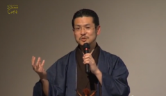
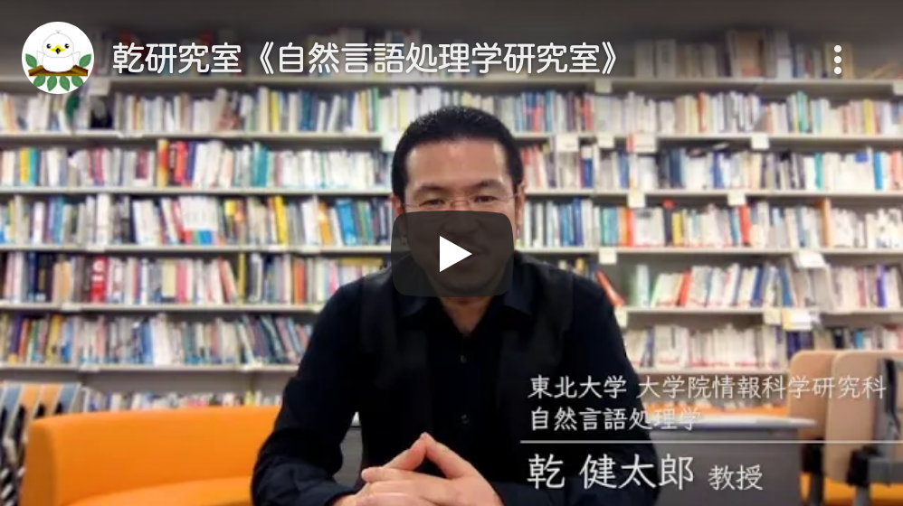

<a class="group-home-link" href="https://www.nlp.ecei.tohoku.ac.jp/">Tohoku NLP Group</a>

<a href="./">English page</a>

[東北大学](http://www.tohoku.ac.jp/japanese) [大学院情報科学研究科](http://www.is.tohoku.ac.jp/) [システム情報科学専攻](http://www.is.tohoku.ac.jp/introduction/organization.html#2) 教授  
[工学部電気情報物理工学科](http://www.ecei.tohoku.ac.jp/eipe/) 兼担  
[タフ・サイバーフィジカルＡＩ研究センター](http://tcpai.tohoku.ac.jp/) 副センター長・ＡＩ研究部門長  

[理化学研究所 革新知能統合研究センター](https://aip.riken.jp/) [自然言語理解チーム](http://www.riken.jp/research/labs/aip/goalorient_tech/nat_lang_understand/)リーダー 兼任  
[国立情報学研究所](http://www.nii.ac.jp/) 客員教授 兼任

[乾・鈴木研究室（知能情報科学講座 自然言語処理学分野）](https://www.nlp.ecei.tohoku.ac.jp/)  
〒980-8579 仙台市青葉区荒巻字青葉6-6-05  
青葉山キャンパス [電子情報システム・応物系1号館](https://www.nlp.ecei.tohoku.ac.jp/about-us/access/) 6階660号室  
電話： 022-795-7091  
ファックス： 022-795-4285  
メール： kentaro.inui.e2 (at) tohoku.ac.jp  
twitter: [@inuikentaro](https://twitter.com/inuikentaro)  

* * *

### 研究

- 研究分野（[研究室の研究内容のページ](https://www.nlp.ecei.tohoku.ac.jp/research/research-topics/)）  
    - 自然言語処理 (natural language processing)
    - 計算言語学 (computational linguistics)
    - 人工知能と推論 (artificial intelligence and inference)
    - 意味・談話解析 (semantic and discourse analysis)
    - 言語処理による教育アセスメント (NLP for educational assessment
    - ウェブ情報処理 (Web computing)
    - 対話理解・管理 (dialogue understanding and management)

- 研究分野の概要
    - 東北大学サイエンスカフェ「言葉がわかるコンピューターはどこまでできたか ～言葉の不思議と自然言語処理の最前線」（[YouTube動画](http://www.youtube.com/watch?v=W285adx2Nr0), [スライド](https://www.cl.ecei.tohoku.ac.jp/~inui/papers/1302ScienceCafe.pdf), 2013年2月）  
        
        
    - [東北大学 電気・情報 東京フォーラム](http://www.riec.tohoku.ac.jp/forum/)「ビッグデータから知をつむぐ自然言語処理」（[動画](http://www.riec.tohoku.ac.jp/riec_contents_open/forum2013/part3-1.html), 2013年11月)
    - [研究室《自然言語処理学研究室》紹介動画](https://youtu.be/IkxSsosyvXQ)（2020年8月）  
        
        
    - [Natural Language Understanding and Assessment](https://www.youtube.com/watch?v=liVCncjROQE&feature=emb_logo), Invited Talk at the 1st International Symposium on AI Electronics, September 2020（[YouTube動画](https://www.youtube.com/watch?v=liVCncjROQE&feature=emb_logo)）  
        
    - 解説記事「言葉が分かるコンピューターを作る」（河北新報「科学の泉」連載・全６回）  
        http://www.kahoku.co.jp/special/spe1124/backnumber201412.html
    - [ビッグデータから知をつむぐ。](http://www.is.tohoku.ac.jp/jp/aobayama/01/)（研究科Webサイト掲載の紹介記事）
    - 一般向けに行った講演のスライドがいくつか[こちら（研究室の研究発表一覧）](https://www.nlp.ecei.tohoku.ac.jp/research/publications/#invited_talks)からご覧いただけます

- 研究発表
    - [研究室の研究発表一覧](https://www.nlp.ecei.tohoku.ac.jp/research/publications/)（2010年以降）
    - [以前の研究発表一覧](https://www.cl.ecei.tohoku.ac.jp/~inui/publication_list.html)  
        

### 学会活動等

- [言語処理学会](https://www.anlp.jp/) 会長, 2022/3-現在
- LREC 2022: Area Co-chair
- ACL Rolling Review (ARR) Action Editor, 2021/5-現在
- ACL-IJCNLP 2021: Workshop Co-chair
- [言語処理学会](https://www.anlp.jp/) 副会長, 2020/3-2022/3
- [COLING 2020](https://coling2020.org/) Area Co-chair
- [ACL 2020](https://acl2020.org/) Area Co-chair
- [EMNLP 2019](https://www.emnlp-ijcnlp2019.org/) General Chair
- [日本学術会議](http://www.scj.go.jp/) 連携会員, 2017/10-現在
- [ファクトチェック・イニシアティブ](http://fij.info/) 理事, 2017/10-現在
- [言語処理学会 会誌「自然言語処理」](http://www.anlp.jp/guide/index.html) 編集長, 2018/4-2019/3
- [言語処理学会 会誌「自然言語処理」](http://www.anlp.jp/guide/index.html) 副編集長, 2016/4-2018/3
- [言語処理学会](https://www.anlp.jp/) 理事, 2016/4-2020/3
- [情報処理学会 自然言語処理研究会](http://www.nl-ipsj.or.jp/) 主査, 2014/4-2018/3
- 大学入試センター 新テスト実施企画委員会 委員, 2016/9-2020/3
- 文部科学省 「大学入学希望者学力評価テスト（仮称）」検討・準備グループ 委員, 2015/10-2017/3
- EMNLP2017 Area Co-chair
- 文部科学省 高大接続システム改革会議 委員, 2015/4-2016/3
- 人工知能学会 代議員, 2015/4-現在 (2017/3)
- [COLING2016](http://coling2016.anlp.jp/) Area Co-chair
- [言語処理学会 第22回年次大会](http://www.anlp.jp/nlp2016/) 実行委員長, 2015/4-2016/3
- [EMNLP2015](http://www.emnlp2015.org/) Area Co-chair
- 情報処理学会 論文誌「学生・若手研究者論文」特集号 編集委員長, 2015/4-2016/1
- 言語処理学会 論文誌「自然言語処理」 「エラー分析」特集号 共同客員編集委員長, 2015/4-12
- 情報処理学会 会誌「情報処理」 特集「自然言語処理の現状と展望：エラー分析プロジェクトを通して」 共同客員編集委員長, 2015/6-11
- 言語処理学会 「自然言語処理におけるエラー分析」ワークショップ 共同組織委員長, 2014/10-2015/3
- [情報処理学会論文誌](http://www.ipsj.or.jp/journal/) 編集委員長, 2014/6-2015/5
- [情報処理学会](http://www.ipsj.or.jp/) 理事, 2013/6-2015/5
- [電子情報通信学会思考と言語研究会](http://www.ieice.org/%7Etl/) 専門委員, 2012-2016
- [社会的知能発生学研究会](http://www.sociointelligenesis.org/) 幹事, 2008-2015

- 会員:
    - [Association for Computational Linguistics (ACL)](http://www.aclweb.org/)
    - [Association for the Advancement of Artificial Intelligence (AAAI)](http://www.aaai.org/home.html)
    - [言語処理学会](http://www.anlp.jp/)
    - [人工知能学会](http://www.ai-gakkai.or.jp/jsai/)
    - [情報処理学会](http://www.ipsj.or.jp/)
    - [電子情報通信学会](http://www.ieice.org/jpn/)

- [過去の活動](./previous_activities)  
    

### 講義

- [人工知能](http://www.nlp.ecei.tohoku.ac.jp/lec/AI/)（学部３年・５セメ）
- [ウェブコンピューティング](https://www.nlp.ecei.tohoku.ac.jp/lec/web-computing/)（学部４年・７セメ）
- [自然言語処理学](https://www.nlp.ecei.tohoku.ac.jp/lec/nlp/)（修士課程）  
    

### 略歴

- 2010/3-現在: 東北大学大学院情報科学研究科 教授
- 2016/9-現在: 理化学研究所 革新知能統合研究センター 自然言語理解チームリーダー兼任
- 2011/10-現在: 国立情報学研究所 客員教授兼任
- 2006/10-2018/3: 情報通信研究機構 有期研究員兼任
- 2004/2-2004/12: 文部科学省長期在外研究 英国サセックス大学
- 2001/10-2010/2: 奈良先端科学技術大学院大学情報科学研究科 助教授
- 1998/10-2001/9: [科学技術振興事業団さきがけ研究21](http://www.jst.go.jp/kisoken/presto/index.html) 研究員兼任
- 1998/4-2002/3: 九州工業大学情報工学部知能情報工学科 助教授
- 1995/4-1998/3: 東京工業大学大学院情報理工学研究科 助手
- 1995/3: 東京工業大学大学院情報理工学研究科博士課程修了　博士（工学）
- 1992/4-1995/3: [日本学術振興会](http://www.jsps.go.jp/j-pd/index.html) 特別研究員
- 1990/3: 東京工業大学工学部情報工学科 卒業
- 1985/3: 千葉県立千葉高校 卒業  
    

### 受賞

- 2022: [文部科学大臣表彰 科学技術賞](https://www.mext.go.jp/b_menu/houdou/mext_00989.html)
- 2022: [言語処理学会2021年度論文賞](https://www.anlp.jp/award/ronbun.html)
- 2022: [言語処理学会第28回年次大会 優秀賞・委員特別賞](https://www.anlp.jp/nlp2022/award.html)
- 2021: [人工知能学会SLUD研究会 対話システムライブコンペティション4 優秀賞](https://dialog-system-live-competition.github.io/dslc3/index.html)
- 2021: [情報処理学会 第249回自然言語処理研究会 優秀研究賞](https://nl-ipsj.or.jp/award/)
- 2021: [言語処理学会第27回年次大会 優秀賞・委員特別賞](https://www.anlp.jp/nlp2021/award.html)
- 2020: [言語処理学会第26回年次大会 言語資源賞](https://www.gsk.or.jp/event/nlp2020-lra/)
- 2020: [言語処理学会第26回年次大会 最優秀賞・優秀賞](https://www.anlp.jp/award/nenji.html#y2020)
- 2019: [Google Focused Research Award](https://ai.google/research/outreach/focused-research-awards/)
- 2019: [言語処理学会第25回年次大会 言語資源賞](https://www.gsk.or.jp/event/nlp2019-lra/)
- 2019: [言語処理学会第25回年次大会 優秀賞](https://www.anlp.jp/award/nenji.html#y2019)
- 2018: [人工知能学会 全国大会優秀賞](http://www.ai-gakkai.or.jp/about/award/jsai_award-conf/)
- 2018: [人工知能学会2017年度論文賞](http://www.ai-gakkai.or.jp/about/award/jsai_award-paper/)
- 2018: [言語処理学会 第24回年次大会 優秀賞](http://www.anlp.jp/award/nenji.html#y2018)
- 2017: [EACL2017 Outstanding Paper Award](http://www.is.tohoku.ac.jp/jp/news/award_p/detail---id-330.html)
- 2017: [言語処理学会 第23回年次大会 優秀賞](http://www.ecei.tohoku.ac.jp/ecei_web/information/2017/news20170322.html)
- 2016: [MIRU2016 優秀賞](https://sites.google.com/site/miru2016hamamatsu/home/awards)
- 2016: IBM Faculty Award
- 2016: [言語処理学会 第22回年次大会 最優秀賞・優秀賞](http://www.anlp.jp/award/nenji.html#2016)
- 2016: [情報処理学会 第225回自然言語処理研究会 優秀研究賞](https://nl-ipsj.or.jp/%E5%84%AA%E7%A7%80%E7%A0%94%E7%A9%B6%E8%B3%9E/)
- 2015: [PACLIC-29 Best Paper Award (Computation)](http://bcmi.sjtu.edu.cn/~paclic29/accepted.php)
- 2015: [第14回ドコモ・モバイル・サイエンス賞（先端技術部門）](http://www.mcfund.or.jp/mobilescience/award/no14.html)
- 2015: [情報処理学会 第221回自然言語処理研究会 優秀研究賞](https://nl-ipsj.or.jp/%E5%84%AA%E7%A7%80%E7%A0%94%E7%A9%B6%E8%B3%9E/)
- 2015: [言語処理学会 第21回年次大会 最優秀賞](http://www.anlp.jp/award/nenji.html#2015)
- 2015: [言語処理学会 2014年度最優秀論文賞](http://www.anlp.jp/award/ronbun.html)
- 2014: [日本学術振興会 科学研究費審査委員表彰](http://www.jsps.go.jp/j-grantsinaid/26_hyosho/hyousyou_2014.html)
- 2014: [AMT2014](http://wic2014.mimuw.edu.pl/amt/homepage) Best Paper Award
- 2014: [言語処理学会 20周年記念論文賞](http://www.anlp.jp/guide/news/v21n3/index.html#first)
- 2014: [言語処理学会 第20回年次大会 最優秀賞・優秀賞](http://www.anlp.jp/award/nenji.html#2014)
- 2014: [言語処理学会 2013年度論文賞](http://www.anlp.jp/award/ronbun.html)
- 2013: 東北大学 工学研究科長教育賞
- 2013: [言語処理学会 第19回年次大会 優秀賞](http://www.anlp.jp/guide/news/v20n2/index.html#fourth)
- 2012: [言語処理学会 第18回年次大会 優秀賞](http://www.anlp.jp/guide/news/v19n2/#forth)
- 2012: [日本経済新聞社「技術トレンド調査（2011年度第1回）」総合3位](http://www.is.tohoku.ac.jp/detail/inui110607.html)
- 2011: CICLing-2011 Best Paper Award (First Place)
- 2010: 言語処理学会 第16回年次大会 最優秀発表賞
- 2007: 言語処理学会 第13回年次大会 優秀発表賞
- 2006: COLING/ACL-2006 Best Asian NLP Paper Award
- 2006: マルチメディア・分散・協調とモバイルシンポジウム（DICOMO）野口賞
- 2004: 言語処理学会 第10回年次大会 優秀発表賞
- 2003: 言語処理学会 第9回年次大会 優秀発表賞
- 2001: 九州工業大学 知能情報工学科ベスト・ティーチャー・オブ・ザ・イヤー
- 2001: 人工知能学会 2000年度研究奨励賞
- 1998: 言語処理学会 第4回年次大会 優秀発表賞
- 1998: 人工知能学会 1997年度論文賞
- 1996: 言語処理学会 第2回年次大会 優秀発表賞  
    

### プライベート

- すけぞう　昭和の香り残る壱弐参（いろは）横町の一角、すばらしい常連さん達に出会えます。仙台市青葉区一番町壱弐参横丁（022-227-5177）
- 文ちゃんうどん　私の中では仙台の「ぶあいそ」。何もかも美味しいです。家族ともどもお世話になってます。仙台市青葉区一番町壱弐参横丁（022-266-3285）
- 味処花祭り　東北の酒と魚の文化を堪能できる小さな居酒屋さん。学生時代に通ったさつきを思い出します。仙台駅西口徒歩3分名掛丁（022-222-3948）
- 白雪　魚料理も野菜料理もいつ行ってもたまりません。もちろん地酒も。仙台市青葉区大町晩翠通沿い（022-224-2776）
- 風のごとく　酒・魚だけでなく野菜料理も楽しめるのがうれしい居酒屋さん。仙台市青葉区国分町1丁目（022-215-4419）
- 一ノ瀬　大将お一人ですべてを切り盛りされてるお店。行くたびに変わる酒と料理、絶品です。神戸市六甲道駅徒歩3分（078-811-3445）
- 日知庵　酒の文化の奥深さと酒の縁の無限の広がりを教えてくれた飲み屋さん。阪急京都線河原町駅徒歩4分（075-231-0374）
- 旬眞庵　愛情たっぷりの料理と酒、そして人に出会える風情豊かな懐石料理屋さん。京都市左京区北白川山ノ元町（075-712-0717）
- 楽庵　日知庵仲間が教えてくれた魚料理屋さん。ここの魚、すごいです。鰤しゃぶ、驚きます。京都市地下鉄四条徒歩3分（075-352-5252）
- 山ぶき　自宅そばのすてきな蕎麦屋さん。蕎麦もさることながら、日本酒のセンスが抜群。近鉄京都線新田辺駅徒歩1分（0774-64-0137）
- ぶあいそ　新田辺で飲むときはほとんどココでした。大将のコテコテ居酒屋料理がたまりません。近鉄京都線新田辺駅徒歩3分（0774-63-7318）
- ひな　１年に１度、鹿児島大の集中講義のときに必ず訪ねます。ご主人もお客さんもみんな温かいです。鹿児島市東千石町（099-224-9678）
- 権蔵　飯塚歓楽街の片隅にあった今はなき幻の飲み屋さん。大将夫妻との数々の思い出は宝物です。本当に本当にお世話になりました。
